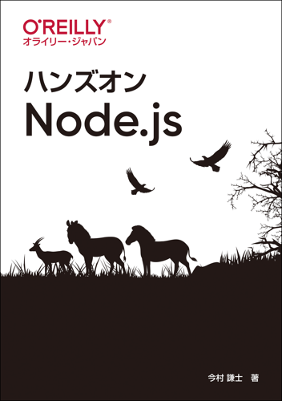

# ハンズオンNode.js

---

---

本リポジトリはオライリー・ジャパン発行書籍『[ハンズオンNode.js](https://www.oreilly.co.jp/books/9784873119236/)』のサポートサイトです。

## ソースコード

### ファイル構成

|フォルダ名 |説明                   |
|:--        |:--                    |
|app-a      |付録Aで使用するデータ  |
|...        |...                    |
|ch01       |1章で使用するデータ    |
|ch02       |2章で使用するデータ    |
|...        |...                    |
|ch10       |10章で使用するデータ   |
|ch11       |11章で使用するデータ   |

ソースコードの解説は本書籍をご覧ください。

## ライセンス

本リポジトリのソースコードは[MITライセンス](http://www.opensource.org/licenses/MIT)です。
商用・非商用問わず、自由にご利用ください。

## 正誤表

本書の正誤情報は以下のページで公開しています。

https://github.com/oreilly-japan/hands-on-nodejs/wiki/errata

本ページに掲載されていない誤植など間違いを見つけた方は、[japan＠oreilly.co.jp](<mailto:japan＠oreilly.co.jp>)までお知らせください。
